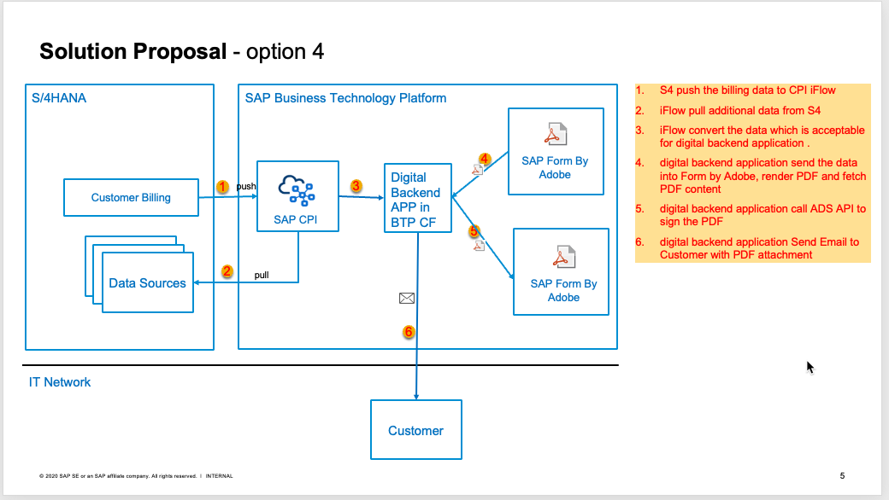
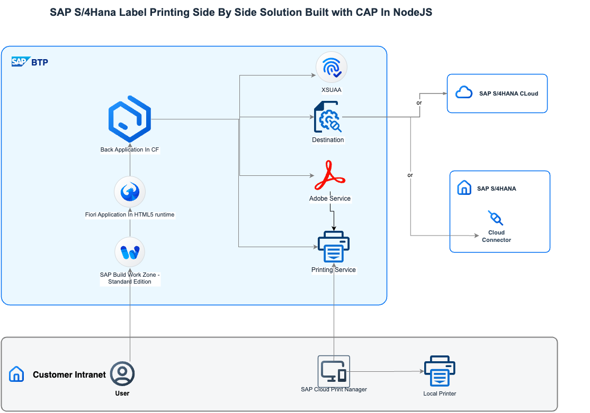

# Output Management Solutions For LOBs In SAP Business Technology Platform To Keep Core Clean

In our LOBs systems like SAP S/4HANA Cloud Public Edition,SAP S/4HANA Cloud Private Edition, SAP S/4HANA OnPremise, scope item [Output Management (1LQ)](https://me.sap.com/processnavigator/SolS/EARL_SolS-055/2023-FPS02/SolP/1LQ?region=DE) will cover the requirements of rendering PDF form used by printing, email.

But there are scenarios where the requirements can not be realized with standard function of 1LQ,the following are some examples:

-  Missing data even tried with key user extensibility.
-  Missing functions like need digital signature in PDF form.
-  Customers need pull data from multiple systems to render PDF form in realtime.
-  Customers need a stand alone application for partners to print PDF form with data from LOB systems in realtime.
-  Customer need to render PDF form in mobile device with data from LOB systems in realtime.
-  Partners want to deploy SAAS solution for customers for Output Management.
-  Other scenarios.

Some scenarios can be realized with On-stack extensibility in ABAP environment. To keep core clean,cloud ABAP are recommended, classic technologies like smartform, SAPscript should be avoided. Adobe Forms technology is recommended.

To keep core clean, Side-By-Side extensibility in SAP Business Technology Platform(BTP) are highly recommended for loosely-coupled scenarios. For Output Management solutions in BTP, we have 2 styles solutions.

First style is automatically label printing or email. This means when business object like billing created in LOB system, the PDF form is automatically rendered with predefined format are automatically sent to a local printer or emailed to specific contact. I wrote a blog [Build Digital Document Platform Backend Service On BTP with BTP Ads Sdm Print Service](https://community.sap.com/t5/technology-blogs-by-sap/build-digital-document-platform-backend-service-on-btp-with-btp-ads-sdm/ba-p/13575468) before. If we use the solution in this blog, we can realize automatically label printing with [SAP Integration Suite](https://discovery-center.cloud.sap/protected/index.html#/serviceCatalog/integration-suite?region=all) or [SAP Build Process Automation](https://discovery-center.cloud.sap/protected/index.html#/serviceCatalog/sap-build-process-automation?region=all) very efficiently. The following is a solution architecture for a real customer use case.

Second style is Side-By-Side extensibility with [CAP](https://cap.cloud.sap/docs/) or [RAP](https://help.sap.com/docs/ABAP_PLATFORM_NEW/fc4c71aa50014fd1b43721701471913d/289477a81eec4d4e84c0302fb6835035.html?locale=en-US&version=202009.latest) as the backend, SAP UI5 as the front end. Here will deploy a SAP UI5 application in SAP Build Work Zone or SAP BTP ABAP environment for the end users. The following is one of the architectures:

 For this style, we prepared the following Discovery Center Missions for you:
- If you prefer  CAP in NodeJs, you can follow the mission [Add Printing Labels to Your User Experience for SAP S/4HANA Cloud with CAP Node.js](https://discovery-center.cloud.sap/protected/index.html#/missiondetail/4500/4787/) 

- If you prefer  CAP in Java,you can follow the mission [Add Printing Labels to Your User Experience for SAP S/4HANA Cloud with CAP Java](https://discovery-center.cloud.sap/protected/index.html#/missiondetail/4522/4810/)

- If you prefer RAP(Cloud ABAP),you can follow the mission [Add Printing Label to Your User Experience for SAP S/4HANA Cloud In BTP ABAP Environment](https://discovery-center.cloud.sap/protected/index.html#/missiondetail/4461/4747/)

All the 3 missions are base on best practice of Side-By-Side extensibility.  You can apply the same method in other Side-By-Side extensibility scenarios.

The mission [Add Printing Label to Your User Experience for SAP S/4HANA Cloud](https://discovery-center.cloud.sap/protected/index.html#/missiondetail/3766/3805/) is based on a little old technology. I will retire the mission.

To better help our customers to learn the solutions, we prepared the following webinars in December 2024. Welcome to register with the following linkages, we are happy to explain and answer queries and discuss.  
- - - 
_Little remind: please reach out to your BTP Customer Success Manager to get the CRM ID for your organisation before the register._
- - -

- 4TH December 2024,  [Add Printing Labels to Your User Experience for SAP S/4HANA Cloud with CAP Node.js](https://events.sap.com/apj/adoption-webinar-sap-btp-add-printing-labels-capnodejs-dec-2024/en/home)
- 11ST December 2024, [Add Printing Labels to Your User Experience for SAP S/4HANA Cloud with CAP Java](https://events.sap.com/apj/adoption-webinar-sap-btp-add-printing-labels-cap-dec-2024/en/home)

These 2 solutions are based on CAP. If you are interested in CAP,I think you can start with the [Learning Sources](https://cap.cloud.sap/docs/get-started/learning-sources).

The Side-By-Side extensibility method used in the missions can be applied to other LOBs like SAP ECC,SAP SuccessFactors HCM,etc.

The ends!
Thanks for your time!

Best regards!

Jacky Liu

